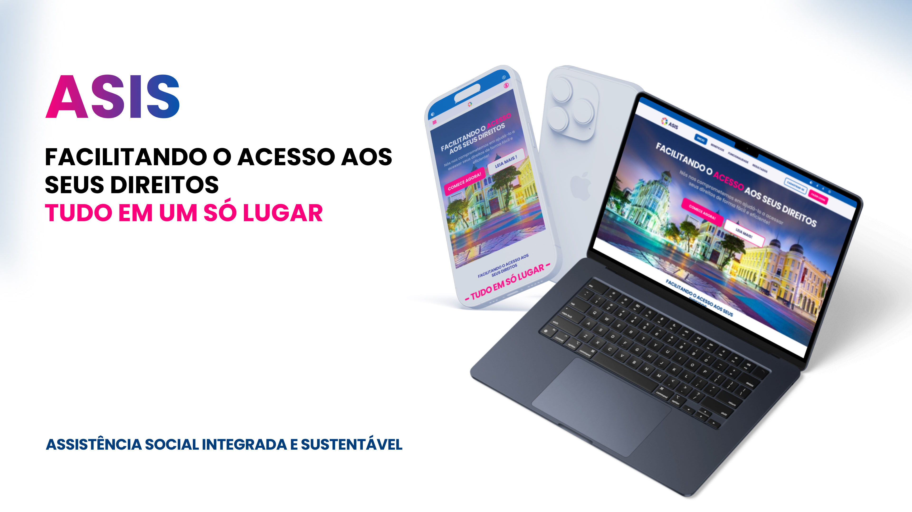

# **PLATAFORMA DE ACESSO E AGENDAMENTO DE SERVIÇOS DE ASSISTENCIA SOCIAL.**

O *ASIS* tem como objetivo desenvolver uma solução para o *Sistema Único de Assistência Social (SUAS), focada na digitalização e padronização do armazenamento de prontuários dos cidadãos atendidos pelos **Centros de Referência de Assistência Social (CRAS)*.

Atualmente, as unidades do CRAS operam de forma isolada, sem integração de dados, o que dificulta o acesso e a atualização das informações. O *ASIS* propõe a unificação desses dados e centraliza o agendamento de serviços, permitindo uma comunicação eficiente entre as unidades, eliminando registros descentralizados e processos burocráticos, trazendo mais eficiência e organização para o atendimento às famílias. como projeto de conclusão de curso do programa START.

# **Funcionalidades:**

- Gerenciamento de Usuários: Cadastro, autenticação, atualização de dados, gerenciamento de permissões
- *Consulta e atualização de dados*
- *Agendamento de visita domiciliar e atualização cadastral*
- Digitalização de prontuários SUAS

# **Tecnologias:**

- React.js: Criação de interfaces para o  usuario.
- JWT (JSON Web Token): Protocolo para autenticação e autorização
- AMQP (Advanced Message Queuing Protocol): Protocolo para comunicação assíncrona, com suporte a RabbitMQ.
- Docker: O Docker é uma plataforma de software que permite aos desenvolvedores criar, testar e implantar aplicações de forma rápida e eficiente. Em termos simples, ele oferece um ambiente isolado e consistente para suas aplicações, garantindo que elas funcionem da mesma forma em qualquer lugar, seja no seu computador, em um servidor ou na nuvem.
- 

# **Modelagem de dados**

**Documentação:**

# **Como Executar:**

# **Observações:**

1. Revise seu código antes de enviar um pull request: Verifique se as alterações estão funcionando corretamente e se seguem os padrões de codificação do projeto.
2. Siga as diretrizes de contribuição: Se houver diretrizes específicas para o projeto, siga-as cuidadosamente.
3. Seja paciente: O processo de revisão de pull requests pode levar algum tempo.

*Agradecemos a sua contribuição!* 🎉

# **Licença:**

[GNU General Public License v3.0](https://github.com/RMouraJr/APIARGUS/blob/main/LICENSE.md)

Equipe de Desenvolvimento:

- Huann Vicente
- Gylleadhe Ferreira
- Letícia Alcântara
- Weydson Duda
- Abrivaldo Neto

# **Agradecimentos:**

Agradecemos ao programa START pela oportunidade de desenvolver este projeto.